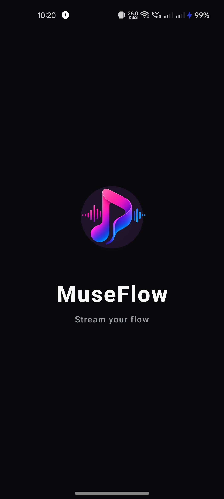
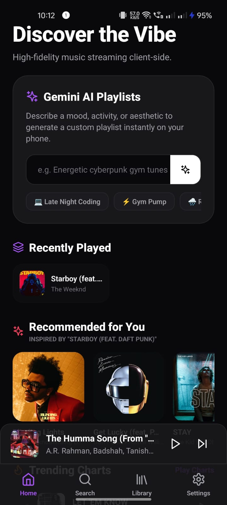
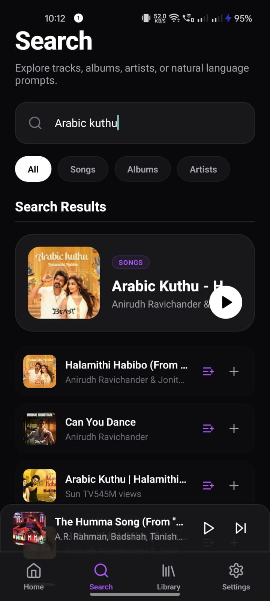
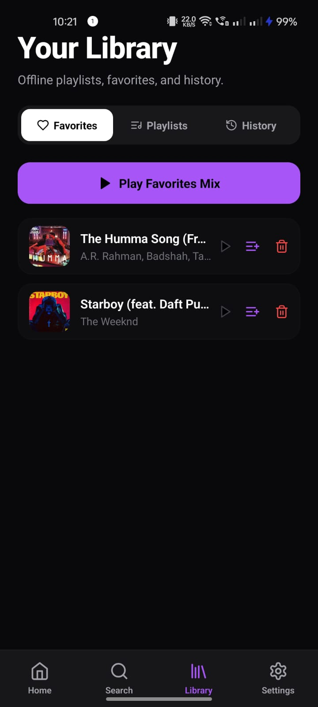
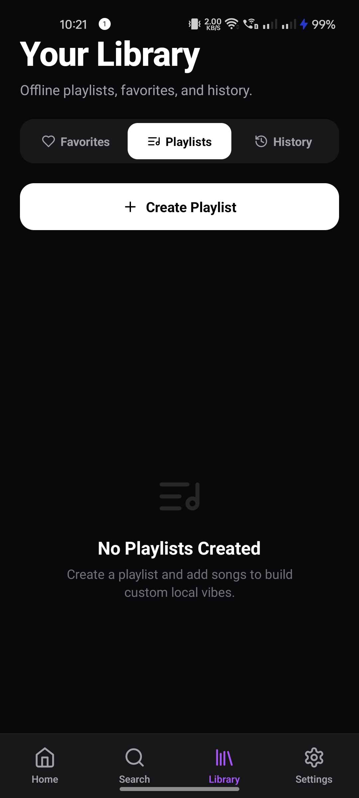
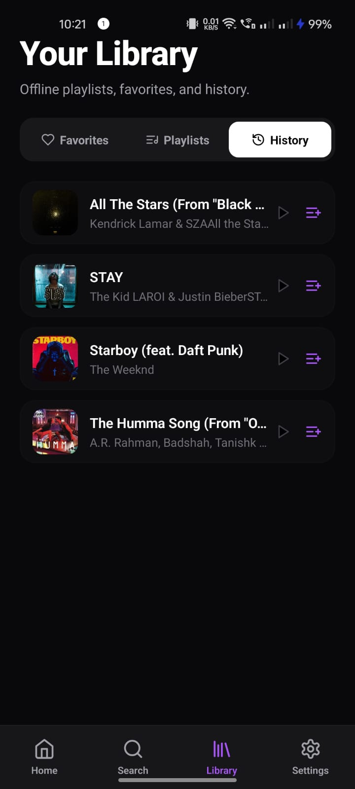
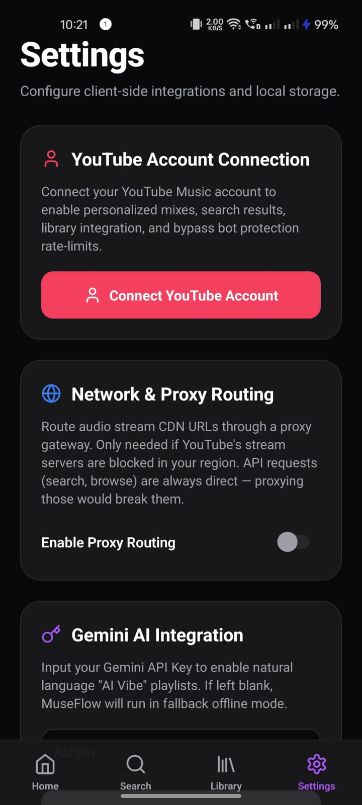
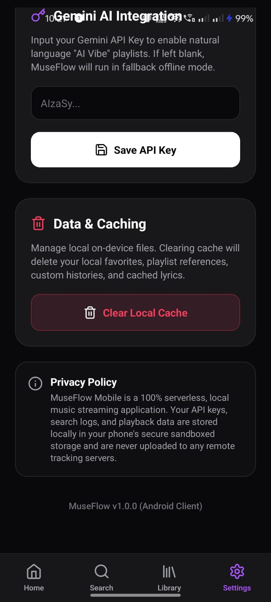

<div align="center">


<a href="https://github.com/mad-man22/museflow-android-app"></a>
<a href="https://github.com/mad-man22/museflow-android-app/releases"></a>

<br /><br />

<h1>🎵 MuseFlow</h1>

<p><strong>A premium, feature-rich music streaming app for Android — built with React Native & Expo, powered by YouTube Music.</strong></p>

<p>MuseFlow delivers a beautiful dark-themed UI with silky-smooth animations, real-time synced lyrics, and an intelligent autoplay queue — all without any API keys.</p>

<br />

<!-- ╔══════════════════════════════════╗ -->
<!--        APK DOWNLOAD BUTTON         -->
<!-- Fill in your EAS/GitHub APK URL    -->
<!-- ╚══════════════════════════════════╝ -->
<a href="https://github.com/mad-man22/museflow-android-app/releases/download/v1.0.0/museflow-v1.0.0.apk">
  
</a>

<br /><br />

</div>

---

## ✨ Features

| Feature | Description |
|---|---|
| 🔍 **Search** | Search any song, artist, or album via YouTube Music |
| 🎧 **HQ Streaming** | Audio streamed directly from YouTube |
| 📃 **Synced Lyrics** | Real-time scrolling lyrics with 300ms look-ahead sync |
| 📋 **Smart Queue** | Rolling 15-track queue — playing song always at position 3 |
| 🔀 **Autoplay** | Fetches recommended tracks automatically to keep music going |
| ⏭️ **Seek Scrubber** | Hardware-accelerated 60fps progress slider with zero lag |
| 🔊 **Volume Control** | Gesture-driven volume slider with native animations |
| 🖼️ **Now Playing** | Full-screen player with album art, controls, and lyrics |
| 📚 **Library** | Save and manage your favourite tracks |
| 🔁 **Repeat & Shuffle** | Full playback mode controls |
| 🌙 **Dark UI** | Glassmorphism, gradients, and premium dark-mode design |

---

## 📸 Screenshots

<p align="center">
  
  
  
  
</p>
<p align="center">
  
  
  
  
</p>

---

## 🏗️ Architecture

```
┌─────────────────────────────────────────────────────────────┐
│                         MuseFlow App                        │
│                                                             │
│  ┌──────────────┐   ┌──────────────┐   ┌────────────────┐  │
│  │  Screens     │   │  Components  │   │   Services     │  │
│  │              │   │              │   │                │  │
│  │ HomeScreen   │   │ Persistent   │   │ ytmusic.ts     │  │
│  │ SearchScreen │──▶│ Player.tsx   │──▶│ (YT Music API) │  │
│  │ LibraryScreen│   │              │   │                │  │
│  │ SettingsScreen   │ Mini Player  │   │ lyrics.ts      │  │
│  │ PlaylistScreen   │ Full Player  │   │ (Lyrics fetch) │  │
│  └──────┬───────┘   │ Scrubbers    │   │                │  │
│         │           │ LyricsDisplay│   │ parser.ts      │  │
│         │           └──────┬───────┘   │ (YT response   │  │
│         │                  │           │  parsing)      │  │
│         ▼                  ▼           │                │  │
│  ┌─────────────────────────────────┐  │ auth.ts        │  │
│  │       Zustand Store             │  │ (Guest tokens) │  │
│  │    usePlaybackStore.ts          │  │                │  │
│  │                                 │  │ gemini.ts      │  │
│  │  currentTrack  │  queue         │  │ (AI features)  │  │
│  │  currentTime   │  isPlaying     │  └────────────────┘  │
│  │  volume        │  isScrubbing   │                       │
│  │  pendingSeek   │  isShuffle     │  ┌────────────────┐  │
│  └────────────────┬────────────────┘  │    Hooks       │  │
│                   │                   │                │  │
│                   ▼                   │ useYouTube     │  │
│  ┌─────────────────────────────────┐  │ Guest.ts       │  │
│  │         expo-av (Audio)         │  └────────────────┘  │
│  │                                 │                       │
│  │  Audio.Sound  ← setPositionAsync│                       │
│  │  onPlaybackStatusUpdate (50ms)  │                       │
│  └─────────────────────────────────┘                       │
└─────────────────────────────────────────────────────────────┘
```

### Data Flow

```
User Action
    │
    ▼
Screen / Component
    │  calls action
    ▼
usePlaybackStore (Zustand)
    │  optimistic state update (sync)
    │  native call (async, non-blocking)
    ▼
expo-av Audio.Sound
    │  onPlaybackStatusUpdate every 50ms
    ▼
Store state updated → UI re-renders (isolated sub-components)
```

### Key Design Decisions

| Decision | Rationale |
|---|---|
| **Isolated sub-components** (`ProgressScrubber`, `VolumeScrubber`, `LyricsDisplay`) | Prevents parent `PersistentPlayer` from re-rendering on every 50ms tick |
| **`Animated.Value` + `PanResponder`** for sliders | Gesture rendering bypasses JS thread entirely — native 60fps |
| **`handleTouchRef` pattern** | Avoids stale closure over `duration` in the once-created `PanResponder` |
| **`pendingSeekTime` gate** | Holds the `isScrubbing` lock until the native player *confirms* the new position via a status tick |
| **`loadToken` counter** | Supersedes in-flight track loads on rapid skip — prevents overlapping audio streams |
| **Optimistic store updates** | All controls (play/pause/seek/volume) update state synchronously before async native calls |
| **Rolling 15-track queue** | Current track fixed at index 2; auto-padded with recommendations for endless playback |

---

## 🛠️ Tech Stack

| Layer | Technology |
|---|---|
| Framework | React Native 0.81 + Expo 54 |
| Language | TypeScript |
| State | Zustand |
| Audio | expo-av |
| Animations | React Native Animated API + PanResponder |
| Lyrics | Custom time-synced parser |
| Music API | YouTube Music via `youtubei.js` |
| Build | EAS Build (cloud) |

---

## 🚀 Getting Started

### Prerequisites

- Node.js 18+
- Expo Go app on your Android/iOS device

### Install & Run

```bash
# Clone the repo
git clone https://github.com/YOUR_USERNAME/museflow-mobile.git
cd museflow-mobile

# Install dependencies
npm install

# Start the Expo dev server
npm start
```

Scan the QR code with **Expo Go** on your device.

---

## 📦 Build APK Yourself

This project uses [EAS Build](https://docs.expo.dev/build/introduction/) for cloud builds — no Android Studio required.

```bash
# Install EAS CLI
npm install -g eas-cli

# Login to your Expo account (free at expo.dev)
eas login

# Build the APK on Expo's servers (~10–15 min)
eas build -p android --profile preview
```

You'll receive a download link when the build completes.

---

## 📁 Project Structure

```
museflow-mobile/
│
├── App.tsx                       # Root with tab navigation
├── app.json                      # Expo config (package name, version)
├── eas.json                      # EAS build profiles (preview = APK)
├── polyfills.ts                  # ReadableStream + global polyfills
│
├── components/
│   └── PersistentPlayer.tsx      # Mini-player + full-screen player
│                                 # (ProgressScrubber, VolumeScrubber,
│                                 #  LyricsDisplay sub-components)
│
├── screens/
│   ├── HomeScreen.tsx            # Trending / recommended feed
│   ├── SearchScreen.tsx          # Search with live results
│   ├── LibraryScreen.tsx         # Saved tracks & playlists
│   ├── PlaylistDetailScreen.tsx  # Playlist tracks view
│   └── SettingsScreen.tsx        # App preferences
│
├── services/
│   ├── ytmusic.ts                # YouTube Music API wrapper & types
│   ├── lyrics.ts                 # Lyrics fetching & time-sync parsing
│   ├── parser.ts                 # YouTube API response parser
│   ├── auth.ts                   # Guest token management
│   ├── decipherer.ts             # YouTube stream URL deciphering
│   ├── gemini.ts                 # AI-powered features
│   └── proxy.ts                  # Network proxy layer
│
├── store/
│   └── usePlaybackStore.ts       # Zustand global playback state
│                                 # (seek, queue, scrubbing lock)
│
└── hooks/
    └── useYouTubeGuest.ts        # YouTube guest session hook
```

---

## ⚙️ Configuration

**No API keys required.** MuseFlow uses YouTube Music's public guest-token flow to fetch music, metadata, and recommendations.

---

## 📄 License

MIT — feel free to use, modify, and distribute.

---

## 🙏 Acknowledgements

A big thank you to [**OpenTune**](https://github.com/Arturo254/OpenTune) for the design inspiration and for showing what a beautiful, open-source music experience on Android can look like. MuseFlow draws inspiration from its UI philosophy and player design.
